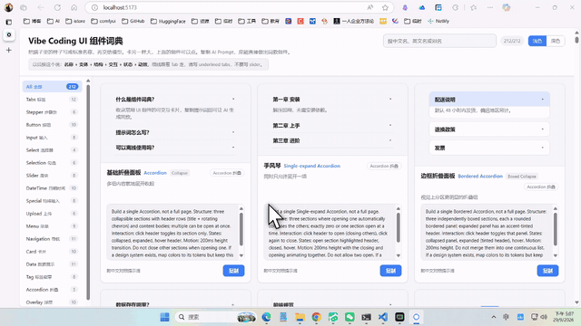

# Vibe Coding UI 组件词典

[](LICENSE)
[](https://github.com/wumajiehechuan-lab/ui-component-dictionary/releases)
[](https://github.com/wumajiehechuan-lab/ui-component-dictionary/stargazers)
[](https://github.com/wumajiehechuan-lab/ui-component-dictionary/network/members)
[](https://github.com/wumajiehechuan-lab/ui-component-dictionary/issues)
[](https://github.com/wumajiehechuan-lab/ui-component-dictionary/commits)


复刻「Vibe Coding UI 组件词典」：收录 UI 组件卡片（可交互演示 + 双语 AI Prompt + 一键复制），开发中把卡片下方的英文提示词丢给 AI，即可做出同款组件。

> 灵感说明：本词典概念源自抖音博主的「Vibe Coding UI 组件词典」；全部组件演示与数据均为原创实现。

## 预览




▶️ [观看完整演示视频（26 秒，GitHub 文件页可直接播放）](./资料/Cap%202026-09-29%20at%2017.07.07.mp4)

> 当前状态：**212 个组件全量交付**（26 个分类全部入库），45+ 个参数化渲染器，0 个占位。

## 快速开始

```bash
npm install        # 首次安装依赖（仅 react / react-dom，无 UI 库）
npm run dev        # 开发预览 http://localhost:5173
npm run build      # 构建到 dist/（注意：type=module 在 file:// 下被 CORS 拦，dist 需走 HTTP 服务打开）
```

## 桌面版（Windows 免安装）

`desktop/` 内含 Electron 封装：主进程起本地静态服务托管 `dist/`（保证 clipboard 安全上下文），窗口加载它。

```bash
cd desktop
npm install                                  # 走 npmmirror 需设 ELECTRON_MIRROR=https://npmmirror.com/mirrors/electron/
npm start                                    # 开发调试
npm run package                              # 打包到 desktop/release/UI组件词典-win32-x64/
```

产物为免安装便携文件夹，双击 `UI组件词典.exe` 即用，无网络要求。体积 ~269MB（Electron 运行时为大头）；打包时 `--ignore node_modules`（主进程只用内置模块）。

**▶️ 已发布 v1.0.0 桌面版**：[GitHub Releases](https://github.com/wumajiehechuan-lab/ui-component-dictionary/releases/tag/v1.0.0) 下载 `UI组件词典-v1.0.0-win64.zip`，解压后双击 exe 即用（Windows 64 位，无需安装、断网可用）。

## 功能

- **搜索**：命中中文俗称 / 标准英文名 / 别名（不区分大小写），与左侧分类叠加生效，头部计数联动
- **分类**：26 个分类（含 All），每项带计数徽标；空分类显示「整理中」
- **演示**：卡片上的组件真实可点（下拉展开、Tab 切换、级联加载、chip 删除、拖动重排等），原生手写、不依赖组件库
- **复制**：一键复制英文 Prompt（clipboard 优先，file:// 下自动降级 execCommand），按钮短暂显示「已复制」
- **主题**：深色 / 浅色即时切换，localStorage 记忆，CSS 变量（token）组织

## 新增一个组件（三步）

1. **加数据**：在 `src/data/components/<分类>.json` 追加一条（新分类则新建 json 文件，零代码改动）。字段：

   | 字段 | 必填 | 说明 |
   |---|---|---|
   | `id` | ✅ | 唯一标识，kebab-case |
   | `category` | ✅ | 必须是 `src/data/categories.json` 里的 key |
   | `name_zh` / `name_en` | ✅ | 中文俗称 / 标准英文 |
   | `aliases` | – | 别名数组（参与搜索） |
   | `when_to_use` | ✅ | 一句话使用场景 |
   | `prompt_en` / `prompt_zh` | ✅ | 双语提示词，按六要素模板（见下） |
   | `demo` | ✅ | `{ type, ...演示数据 }`，type 对应渲染器 |

2. **加渲染器**（仅当 `demo.type` 是新形态）：在 `src/demos/<分类>/` 写一个 `XxxDemo.jsx`，并在 `src/demos/registry.js` 注册一行。未注册的 type 自动显示「演示待实现」占位——**数据可以先入库，渲染器后补**。

3. **自检**：dev 模式控制台无 `[词典数据]` 校验报错；搜索/分类/复制/演示均正常。

### Prompt 六要素模板

```
Build a single {组件英文名} {变体}, not a full page.
Structure: {结构描述，含默认标签/示例数据}
Interaction: {交互描述}
States: {状态枚举}
Motion: {动效描述（如需要）}
Do not use {反例约束：易混淆的同类组件}
If a design system exists, map colors to its tokens but keep this structure.
No extra page chrome, no emoji.
```

### Checklist

- [ ] `id` 全库唯一，`category` 合法
- [ ] prompt 含反例约束（Do not use …）与设计系统 token 句
- [ ] **改 demo 数据必须同步核对 `prompt_en` 里的 Structure 描述**，防止两者漂移
- [ ] 演示数据默认值遵循约定：Tab 用 Overview/Billing/Settings；级联/树用 中国→上海→浦东；多选用 React/Vue/Angular；OTP 6 位

## 架构速览

```
src/
├── data/            数据层：categories.json + components/*.json（import.meta.glob 聚合）
├── hooks/           useTheme / useCopy / useFilter
├── components/      Header / Sidebar / CardGrid / ComponentCard / CopyButton
├── demos/           registry.js（type→渲染器）+ DemoHost（分发）+ FallbackDemo（兜底）
│   └── _shared/     Dropdown / Chip / useTabs / useClickOutside / demo.css 公共件
└── styles/          tokens.css（唯一颜色定义）/ base / layout
```

依赖纪律：运行时只允许 `react` + `react-dom`，任何 demo 不得引入第三方库（离线承诺靠这条保证）。

## 演示简化说明

「富文本 / Markdown / 代码编辑器」三个 demo 为**简化版**（只求认得出组件形态），对应 `prompt_en` 仍按完整体验撰写——prompt 是给 AI 的交付物，不跟随演示降级。

## 稳定性约定

- **DemoErrorBoundary**：每个 demo 单独包错误边界，单个渲染器崩溃只影响自己那张卡（显示「演示崩溃：type + 错误信息」），不再拖死整页。
- **禁止无条件 `autoFocus`**：demo 输入框挂载即聚焦会把页面滚动到该卡片（真实浏览器同样中招）。只允许出现在交互后才条件渲染的输入框里。
- **调试辅助**：URL 加 `?limit=N` 只渲染前 N 张卡（headless 二分定位用），`?theme=dark` 强制深色主题。

## 维护

新增组件仍走「三步」流程（见上）。数据层 22 个分类文件共 212 条；`registry.js` 中 type→渲染器映射 48 项。
